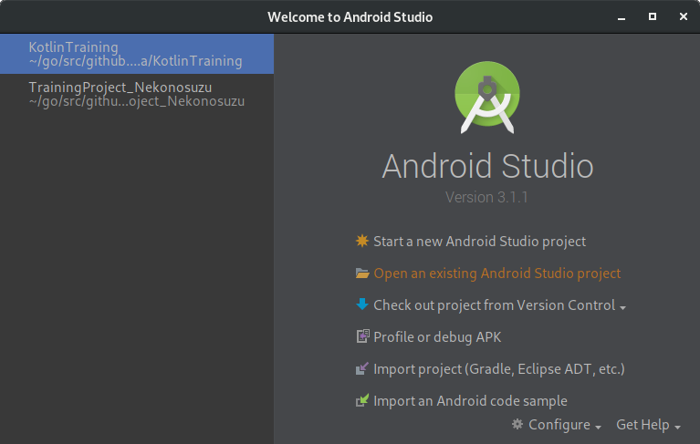

# 開発環境の構築

Kotlin を用いた開発を行うための環境構築について記載します。

## ゴール

* サンプルプロジェクトを各位の GitHub アカウントに fork する
* fork したリポジトリを clone する
* clone したサンプルプロジェクトを Android Studio で読み込む
* SampleTest を実行し、welcome メッセージを確認する
* Sample.kt を編集し、hello world を出す関数を定義する
* hello world を出す関数を SampleTest クラスから呼び出す
* できあがったら GitHub へ push

## サンプルプロジェクトを fork する

* [サンプルプロジェクトはココ](https://github.com/pankona/KotlinTraining)
* ページ右上の「Fork」ボタンを押す

## fork したリポジトリを clone する

* fork したリポジトリのページを開く
  * URL は https://github.com/(各位のアカウント名)/KotlinTraining となっているはず
* 「Clone or download」ボタンを押すと「Clone with SSH」となっているはず
  * なってない場合は、そばに「Use SSH」というリンクがあるはずなのでそれを押す
* 下部に表示されている URL をコピーする
  * git@github.com:(各位のアカウント名)/KotlinTraining.git みたいになっているはず
* ターミナルを開き、任意の位置に clone する
  * 以下のようなコマンドを打つ

```bash
$ git clone git@github.com:(各位のアカウント名)/KotlinTraining.git
```

* 正常に完了すると、リポジトリのソースコード一式がダウンロードされる

## clone したサンプルプロジェクトを Android Studio で読み込む

* 無事に clone は済んだだろうか
* 次に clone したソースコードを Android Studio で読み込む
* Android Studio を起動し、「Open an exisiting Android Studio project」を選ぶ

  
↑ Android Studio を開いたところ

* ファイルエクスプローラが起動するので、先程 clone したところを選ぶ

  
↑ clone したサンプルプロジェクトを選ぶ (アイコンが緑の丸っぽいのを選ぶ)

* 選ぶと自動的にビルドが始まり、必要なもののダウンロード等が始まったりする

## SampleTest を実行し、welcome メッセージを確認する

* SampleTest クラスを見つけてみよう
* 見つけたら、右クリックで選択し、`Run 'SampleTest'` を選択
* welcome メッセージが出るかな

## Sample.kt を編集し、hello world を出す関数を定義する

* Sample.kt を探し、以下のようなコードを書いてみましょう。

```kotlin
fun hello() {
    println("Hello World!")
}
```

## `hello` を SampleTest クラスから呼び出す

* SampleTest を編集し、先ほど Sample.kt に定義した `hello` を呼び出してみよう
* うまく呼び出せただろうか

## GitHub へ push

* 変更したファイルを GitHub の master ブランチへ push しよう
* 以下、git の使い方メモ

```bash
# 変更があるファイルを確認する
$ git status

# 変更内容の確認
$ git diff

# ファイルを staging する
$ git add [staging したいファイルを選択]

# commit する (コミットログには変更内容を簡単に書く)
$ git commit -v # -v をつけると commit される内容の確認ができて便利よ！

# master へ push する
$ git push origin master
```

